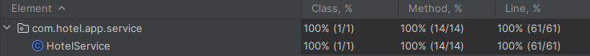

# Hotel-App
Technical task for GP Solutions

## What is it?
This is a Spring Boot application for managing hotels. It provides a REST API for creating, retrieving, and filtering hotels, as well as adding amenities to hotels.

## Technologies Used
- **Spring Boot**
- **Spring Web**
- **Spring Data JPA**
- **H2 Database**
- **Maven**

## Features

- **Hotel filtering**: Filter hotels based on name, brand, city, country, and amenities.
- **Database support**: Uses H2 database for storing hotel data.
- **API Documentation**: Automatically generated Swagger UI for API endpoints using Springdoc OpenAPI.
  
  
## Endpoints

You can refer to the Swagger documentation available at 
` http://localhost:8092/swagger-ui/index.html` 
after running application. The Swagger interface provides a comprehensive overview of the API, including:

#### For Retrieving Hotels
- **`GET /api/hotels`** - Retrieve a list of all hotels.
- **`GET /api/hotels/{id}`** - Retrieve a specific hotel by its ID.
- **`GET /api/hotels/search?name={name}&brand={brand}&city={city}&country={country}&amenities={amenities}`** - Filter hotels by name, brand, city, country, or amenities.

#### For Creating and Updating Hotels
- **`POST /api/hotels`** - Create a new hotel.
- **`PUT /api/hotels/{id}/amenities`** - Add amenities to a specific hotel.

#### For Analytics
- **`GET /api/hotels/histogram?param={brand|city|country|amenities}`** - Retrieve a histogram of hotels based on the specified parameter (brand, city, country, or amenities).


## Installation & Running

### Prerequisites
- Java Development Kit (JDK) 21 or later
- Apache Maven 3.9.6

### Clone the repository
```bash
git clone https://github.com/k9targex/Hotel-App.git
```

### Navigate into the directory
```bash
cd Hotel-App
```

### Run the application
```bash
mvn spring-boot:run
```


## Unit Tests

This project includes unit tests written using **JUnit 5**. Unit tests ensure that individual components of the application are working as expected.


### Running Tests

To run the unit and integration tests for this project:

```bash
mvn test
```
## Swagger API Documentation
The project includes Swagger integration via the Springdoc OpenAPI library. Once the application is running, you can access the interactive Swagger UI at the following URL:
```
http://localhost:8092/swagger-ui.html
```
Swagger provides a convenient interface for testing API endpoints directly from the browser, along with automatic documentation of request parameters and responses.


## H2 Database Configuration
By default, the project is configured to use an in-memory H2 database for simplicity. If you want to switch from the H2 database to another relational database (e.g., MySQL, PostgreSQL), you can easily do so by modifying the application.properties file.

## Author
Developed by Mozheiko Dmitry.
